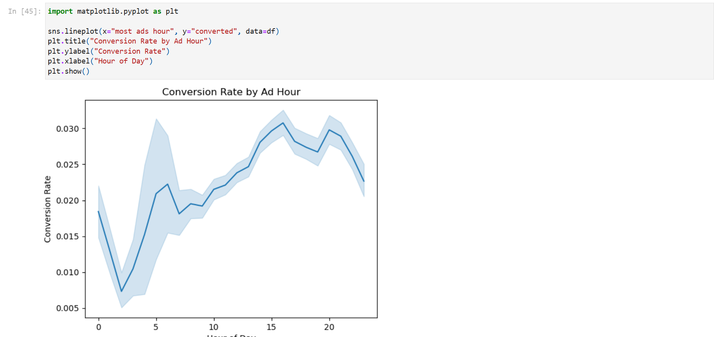
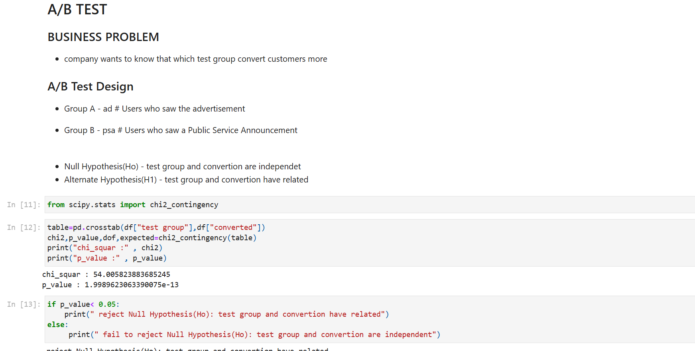
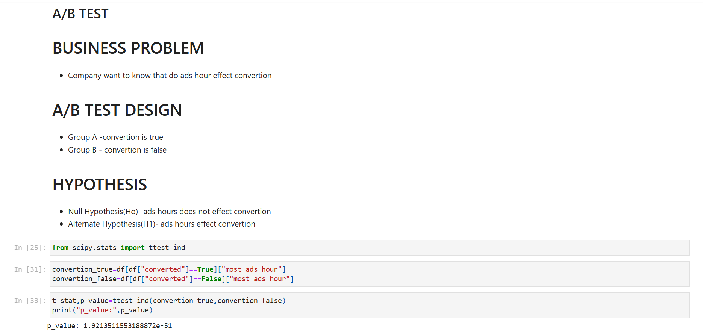

# Marketing A/B Testing Analysis

## Project Description
This project analyzes a marketing campaign dataset to determine which type of advertisement leads to higher customer conversion. Using Python, statistical testing, and data visualization, the project provides insights and actionable recommendations for improving marketing strategies.  

---

## Dataset
The dataset contains information about users exposed to different campaigns (Advertisement vs Public Service Announcement), their conversion status, total ads viewed, and ad exposure timing.  

**Source:** [Kaggle - Marketing A/B Testing](https://www.kaggle.com/datasets/faviovaz/marketing-ab-testing)  

---

## Business Problem / Objective
- Determine which test group (Ad or PSA) converts more users.  
- Understand whether the hour of ad exposure affects conversion.  
- Provide actionable recommendations to improve campaign ROI.  

---

## Analysis & Methods
- **Exploratory Data Analysis (EDA)** using Pandas, Seaborn, and Matplotlib.  
- **Chi-Square Test** to analyze the relationship between test group and conversion.  
- **T-Test** to check if ad hours significantly affect conversion.  
- **Conversion rate calculations** for both Ad and PSA groups.  
- **Visualizations** to highlight insights: barplots and lineplots.  

---

## Key Insights
- Ad group conversion: **2.55%**  
- PSA group conversion: **1.79%**  
- Conversion rates peak during **afternoon and evening (2 PM – 9 PM)**.  
- Higher ad frequency increases the likelihood of conversion:  
  - Very Low: 0.25%  
  - Low: 0.70%  
  - Medium: 2.88%  
  - High: 11.39%  
  - Very High: 17.36%  

---

## Recommendations
- Prioritize **Advertisement campaigns** for better conversions.  
- Schedule ads during **high-conversion hours** (2 PM – 9 PM).  
- Focus on **relevant customer segments** based on interests and demographics (e.g., age, newly parents, product type).  
- Optimize ad spending by **reducing low-conversion time slots** (12 AM – 4 AM).  

---

## Project Structure

Marketing-A-B-Testing-Analysis/
├─ Python/ # Jupyter Notebook with full analysis
│ └─ marketing_ab_test_analysis.ipynb
├─ Screenshots/ # Key visualizations
│ ├─ conversion_rate_by_hour.png
│ ├─ Chi_Square_Test.png
│ └─ ttest_ind.png
└─ README.md # Project description and instructions

---

## Screenshots
  
  
  

---

## How to Run
1. Clone the repository.  
2. Download the dataset from [Kaggle](https://www.kaggle.com/datasets/faviovaz/marketing-ab-testing).  
3. Open `Python/marketing_ab_test_analysis.ipynb` in Jupyter Notebook.  
4. Run the notebook cells sequentially to reproduce the analysis.  

